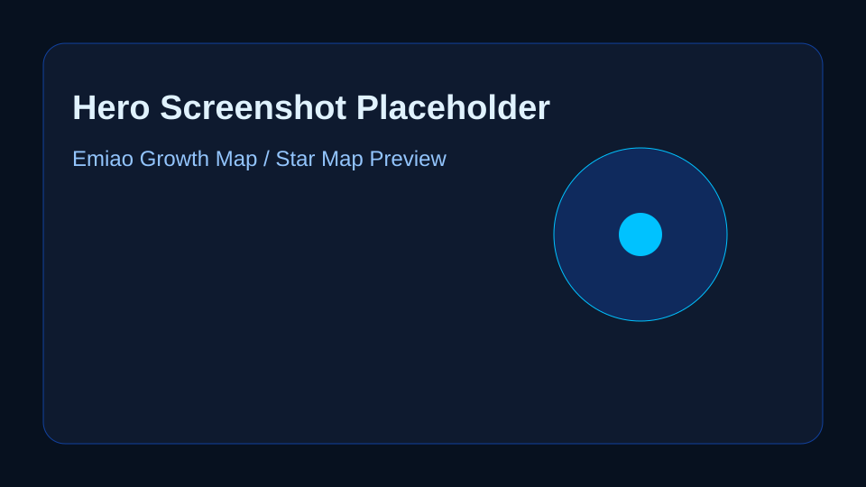
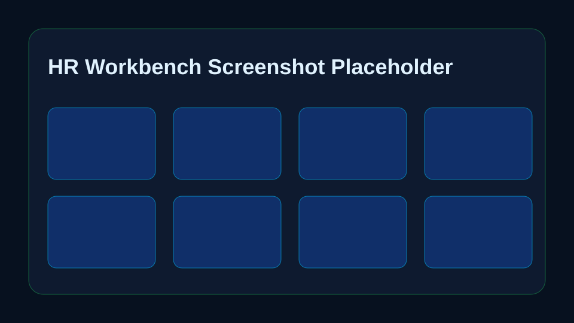
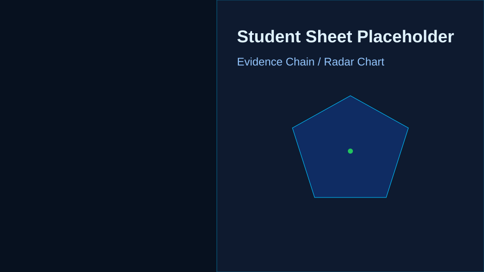

# 鹅苗星图 Emiao Growth Map

AI 实习生成长导航看板，用于“腾讯 AI-HR 培训生线上实战营”作业四：「实习能量站」业务部新人成长导航智能看板。

在线体验：

> Render 部署完成后，把线上地址填在这里。

截图占位：

| Hero 首屏 | HR 工作台 | 学生详情抽屉 |
| --- | --- | --- |
|  |  |  |

## 项目定位

鹅苗星图不是为了“管住新人”，而是把实习生、导师和 HR 放到同一张成长地图上，让任务、反馈、风险和适岗信号被及时看见。

核心业务假设：

- 实习生需要知道每个阶段下一步该学什么、交付什么。
- 导师需要标准化带教节奏，而不是完全依赖个人经验。
- HR / HRBP 需要过程数据和适岗证据，而不是反复在私聊里追问。
- AI 负责重复整理、提醒、归纳和初步判断；最终沟通、分寸和决策仍由人完成。

## 作业四匹配说明

本项目明确对应作业四「实习能量站」业务部新人成长导航智能看板，不是作业三的「30-60-90 学习路径」。页面保留 Day 1 / Day 7 / Day 14 / Day 30 / Day 60 / Day 90 作为时间观察点，但主线是“入营 → 上手 → 协同 → 产出 → 适岗复盘”的实习生成长导航。

作业四场景中的三个问题分别被产品化解决：

- 实习生迷茫：通过岗位任务、成长地图、AI 陪跑建议，让新人知道下一步该做什么。
- 导师凭经验：通过反馈对象选择、反馈生成器、反馈及时率和待反馈列表，沉淀标准化带教节奏。
- HR 信息断点：通过 HR 工作台、动态风险原因、适岗证据链和 AI 周报，让 HRBP 看到过程数据，而不是只靠私聊追问。

## 1000 字方案说明入口

建议将以下结构扩写为 1000 字提交说明：

1. 背景痛点：20 名实习生分布在研发、产品、销售，导师带教节奏不一，HRBP 难以及时看到风险和适岗证据。
2. 产品定位：鹅苗星图不是管理工具，而是成长支持工具，让每一次任务、反馈、困惑和成长信号被看见。
3. 核心闭环：实习生完成任务 → 导师生成反馈 → 系统更新标签、风险、能量值 → HR 查看证据链与周报 → 反向推动导师和实习生行动。
4. AI 边界：AI 负责整理、提醒、归纳和初步风险识别，不直接作为录用或淘汰依据。
5. 课程映射：角色入口对应沟通型 HR，总览看板对应分析型 HR，星图视觉对应创意型 HR，AI 反馈/周报/状态联动对应技术应用型 HR。
6. 腾讯文化：用户为本、科技向善、正直、进取、协作、创造都嵌入功能，而不是只放在说明页。

## 技术栈

- Next.js App Router
- TypeScript
- Tailwind CSS
- shadcn/ui 风格组件
- lucide-react
- Recharts
- framer-motion
- Mock data，无后端、无登录、无数据库

## 数据闭环

Demo 顶层维护 `studentsState`，所有角色共用同一份模拟状态：

- 总览 KPI、图表、AI 周报根据 `studentsState` 实时计算。
- 实习生勾选任务会更新该学生 `progress`、`energy`、`stage` 和风险状态。
- 导师生成反馈会更新该学生 `lastFeedback`、`feedbackCount`、`tags`、`feedbackHistory` 和下一步行动。
- 风险状态根据任务进度、反馈次数、目标不清、融入慢等信号动态计算。
- HR 详情抽屉展示适岗证据链：已完成任务、导师反馈、行为信号、AI 建议。

## 已实现交互

- 首屏按钮滚动到体验区
- 三角色工作台切换：实习生 / 导师 / HRBP
- 实习生选择器，按研发 / 产品 / 销售展示不同任务
- 实习生任务 checklist 点击完成，进度条、能量值、风险状态实时变化
- 导师选择反馈对象，AI 反馈拆成“肯定 / 建议 / 下周行动”
- 反馈生成后写入该学生详情
- AI 周报根据当前学生状态重新生成，带 loading 状态
- HR 岗位筛选与成长状态筛选
- 点击实习生卡片打开右侧详情抽屉
- 详情抽屉展示适岗证据链，并说明 AI 风险判断只作为沟通线索
- 适岗雷达图、岗位分布、阶段分布、风险类型图表 hover
- 移动端响应式布局

## 1 分钟演示视频脚本

0-10 秒：展示 Hero 首屏，介绍“鹅苗星图 Emiao Growth Map”是作业四的 AI 实习生成长导航看板，右侧星图代表 20 位实习生和 AI 节点。

10-20 秒：点击“开始体验”，进入角色入口，说明三类用户都有工作台，体现用户为本和沟通型 HR。

20-35 秒：进入实习生工作台，选择不同岗位实习生，勾选任务，展示任务进度、成长能量和 AI 陪跑建议实时变化。

35-45 秒：切到导师工作台，选择反馈对象，输入观察内容，生成“肯定 / 建议 / 下周行动”，说明反馈会写回学生详情。

45-55 秒：切到 HR 工作台，筛选“需关注”或“高适岗”，打开学生详情抽屉，展示成长轨迹、风险判断和适岗证据链。

55-60 秒：回到总览看板，点击重新生成 AI 周报，强调 AI 只做整理和初步判断，最终沟通和决策仍由导师与 HR 完成。

## 本地运行

```bash
npm install
npm run dev
```

打开：

```txt
http://localhost:3000
```

生产构建验证：

```bash
npm run build
npm run start
```

## Render 部署

本仓库已包含 `render.yaml` 和 `.node-version`，可以直接部署到 Render。

推荐方式：

1. 打开 Render Dashboard，选择 **New + → Web Service**。
2. 连接 GitHub 仓库 `hansu650/tencent-homework`。
3. Root Directory 保持仓库根目录。
4. Runtime 选择 `Node`。
5. Build Command 使用：

```bash
npm install && npm run build
```

6. Start Command 使用：

```bash
npm run start
```

7. 环境变量可保留 `NODE_VERSION=22.13.0`，避免构建依赖出现 Node 小版本提示。

Render 官方文档说明 Next.js 可作为 Node Web Service 部署，并使用 build/start 命令完成发布；Render 也支持通过 `.node-version`、`.nvmrc`、`engines` 或 `NODE_VERSION` 固定 Node 版本。

## 最适合截图的页面

- Hero 首屏：产品名、AI 实习生成长导航、星图式产品预览。
- 角色入口：三种用户视角，能体现多角色协同。
- HR 工作台：20 名实习生卡片、筛选器和风险/适岗标签。
- 学生详情抽屉：成长轨迹、导师反馈、AI 风险判断、适岗雷达图。
- AI 能力设计与课程内容映射：适合放进作品说明页。

## 最适合录演示视频的功能

- 点击“开始体验”滚动到体验区。
- 切换实习生、导师、HR 三个角色工作台。
- 在实习生工作台勾选任务，展示进度变化。
- 在导师工作台输入观察内容并生成反馈。
- 在 HR 工作台筛选岗位/状态，点击学生卡片打开详情抽屉。
- 在总览看板点击“重新生成周报”，展示 AI loading 和新周报。

## 作业四提交说明建议

可以这样包装：

> 我设计的作品叫“鹅苗星图 Emiao Growth Map”，它面向业务部 20 名校招实习生的带教场景。产品不是单纯记录任务，而是把实习生、导师和 HRBP 放到同一张成长地图上，让每一次任务、反馈、困惑和适岗信号都能被看见。AI 在其中负责重复整理、反馈归纳、风险识别和周报生成，导师和 HR 仍然负责真正的人情判断、沟通分寸和最终决策。这个设计对应训练营中沟通型、分析型、创意型、技术应用型 HR 的能力：既连接多角色，也用数据辅助判断，并通过“鹅苗星图”和“成长能量”把实习带教做成更有温度的产品体验。

## 目录结构

```txt
app/
  globals.css
  layout.tsx
  page.tsx
components/
  emiao-growth-map.tsx
  star-map.tsx
  ui/
data/
  mockStudents.ts
lib/
  growth.ts
  utils.ts
```

## 参考方向

项目结构和视觉方向参考了 Next.js + shadcn dashboard、Tremor 数据看板、Magic UI 动效语言、onboarding 产品逻辑等开源项目，但业务结构、文案、mock 数据和页面实现均围绕“实习能量站”重新设计。
